# ERP ER Diagram

This is a simplified, readable ER diagram for the main ERP tables in this project.

Source used:
- `db/pharmacy.sql`
- `budget_migration.sql`
- `wasfaty_setup_clean.sql`
- `docs/DATA_DICTIONARY.md`

Important:
- Some relations are enforced by real foreign keys.
- Many business relations are "logical" links by `*_id` columns even when the SQL dump does not define an FK constraint.
- This document focuses on the tables you will usually need to understand first.

## 1. Very Simple Business Flow

```text
Suppliers -> Purchases -> Purchase Items -> Products -> Sale Items -> Sales -> Customers
                                      |
                                      v
                             Warehouse Stock

Warehouses also connect to:
- Transfers
- Stock Counts
- Adjustments
- Users

Accounting is separate but linked like this:
Accounts -> Account Groups -> Ledgers -> Journal Entries -> Entry Items
```

## 2. Main ERP ER Diagram

```mermaid
erDiagram
    SMA_GROUPS ||--o{ SMA_USERS : "group_id"
    SMA_WAREHOUSES ||--o{ SMA_USERS : "warehouse_id"
    SMA_COMPANIES ||--o{ SMA_USERS : "company_id"
    SMA_COMPANIES ||--o{ SMA_USERS : "biller_id (logical)"

    SMA_COMPANIES ||--o{ SMA_ADDRESSES : "company_id"
    SMA_CUSTOMER_GROUPS ||--o{ SMA_COMPANIES : "customer_group_id"
    SMA_PRICE_GROUPS ||--o{ SMA_COMPANIES : "price_group_id"

    SMA_CATEGORIES ||--o{ SMA_PRODUCTS : "category_id"
    SMA_BRANDS ||--o{ SMA_PRODUCTS : "brand"
    SMA_UNITS ||--o{ SMA_PRODUCTS : "unit"
    SMA_UNITS ||--o{ SMA_PRODUCTS : "sale_unit"
    SMA_UNITS ||--o{ SMA_PRODUCTS : "purchase_unit"
    SMA_COMPANIES ||--o{ SMA_PRODUCTS : "supplier1..supplier5"

    SMA_PRODUCTS ||--o{ SMA_PRODUCT_PHOTOS : "product_id"
    SMA_PRODUCTS ||--o{ SMA_PRODUCT_VARIANTS : "product_id"
    SMA_PRODUCTS ||--o{ SMA_PRODUCT_PRICES : "product_id"
    SMA_PRICE_GROUPS ||--o{ SMA_PRODUCT_PRICES : "price_group_id"

    SMA_PRODUCTS ||--o{ SMA_WAREHOUSES_PRODUCTS : "product_id"
    SMA_WAREHOUSES ||--o{ SMA_WAREHOUSES_PRODUCTS : "warehouse_id"

    SMA_PRODUCTS ||--o{ SMA_WAREHOUSES_PRODUCTS_VARIANTS : "product_id"
    SMA_PRODUCT_VARIANTS ||--o{ SMA_WAREHOUSES_PRODUCTS_VARIANTS : "option_id"
    SMA_WAREHOUSES ||--o{ SMA_WAREHOUSES_PRODUCTS_VARIANTS : "warehouse_id"

    SMA_COMPANIES ||--o{ SMA_PURCHASES : "supplier_id"
    SMA_WAREHOUSES ||--o{ SMA_PURCHASES : "warehouse_id"
    SMA_USERS ||--o{ SMA_PURCHASES : "created_by"
    SMA_PURCHASES ||--o{ SMA_PURCHASE_ITEMS : "purchase_id"
    SMA_PRODUCTS ||--o{ SMA_PURCHASE_ITEMS : "product_id"
    SMA_WAREHOUSES ||--o{ SMA_PURCHASE_ITEMS : "warehouse_id"
    SMA_PRODUCT_VARIANTS ||--o{ SMA_PURCHASE_ITEMS : "option_id"
    SMA_UNITS ||--o{ SMA_PURCHASE_ITEMS : "product_unit_id"

    SMA_COMPANIES ||--o{ SMA_SALES : "customer_id"
    SMA_COMPANIES ||--o{ SMA_SALES : "biller_id"
    SMA_WAREHOUSES ||--o{ SMA_SALES : "warehouse_id"
    SMA_ADDRESSES ||--o{ SMA_SALES : "address_id"
    SMA_USERS ||--o{ SMA_SALES : "created_by"
    SMA_SALES ||--o{ SMA_SALE_ITEMS : "sale_id"
    SMA_PRODUCTS ||--o{ SMA_SALE_ITEMS : "product_id"
    SMA_WAREHOUSES ||--o{ SMA_SALE_ITEMS : "warehouse_id"
    SMA_PRODUCT_VARIANTS ||--o{ SMA_SALE_ITEMS : "option_id"
    SMA_UNITS ||--o{ SMA_SALE_ITEMS : "product_unit_id"

    SMA_COMPANIES ||--o{ SMA_QUOTES : "customer_id"
    SMA_COMPANIES ||--o{ SMA_QUOTES : "biller_id"
    SMA_WAREHOUSES ||--o{ SMA_QUOTES : "warehouse_id"
    SMA_QUOTES ||--o{ SMA_QUOTE_ITEMS : "quote_id"
    SMA_PRODUCTS ||--o{ SMA_QUOTE_ITEMS : "product_id"

    SMA_COMPANIES ||--o{ SMA_RETURNS : "customer_id"
    SMA_COMPANIES ||--o{ SMA_RETURNS : "biller_id"
    SMA_WAREHOUSES ||--o{ SMA_RETURNS : "warehouse_id"
    SMA_RETURNS ||--o{ SMA_RETURN_ITEMS : "return_id"
    SMA_PRODUCTS ||--o{ SMA_RETURN_ITEMS : "product_id"

    SMA_SALES ||--o{ SMA_PAYMENTS : "sale_id"
    SMA_PURCHASES ||--o{ SMA_PAYMENTS : "purchase_id"
    SMA_RETURNS ||--o{ SMA_PAYMENTS : "return_id"
    SMA_USERS ||--o{ SMA_PAYMENTS : "created_by"

    SMA_WAREHOUSES ||--o{ SMA_TRANSFERS : "from_warehouse_id"
    SMA_WAREHOUSES ||--o{ SMA_TRANSFERS : "to_warehouse_id"
    SMA_TRANSFERS ||--o{ SMA_TRANSFER_ITEMS : "transfer_id"
    SMA_PRODUCTS ||--o{ SMA_TRANSFER_ITEMS : "product_id"
    SMA_PRODUCT_VARIANTS ||--o{ SMA_TRANSFER_ITEMS : "option_id"

    SMA_WAREHOUSES ||--o{ SMA_ADJUSTMENTS : "warehouse_id"
    SMA_ADJUSTMENTS ||--o{ SMA_ADJUSTMENT_ITEMS : "adjustment_id"
    SMA_PRODUCTS ||--o{ SMA_ADJUSTMENT_ITEMS : "product_id"
    SMA_PRODUCT_VARIANTS ||--o{ SMA_ADJUSTMENT_ITEMS : "option_id"

    SMA_WAREHOUSES ||--o{ SMA_STOCK_COUNTS : "warehouse_id"
    SMA_STOCK_COUNTS ||--o{ SMA_STOCK_COUNT_ITEMS : "stock_count_id"
    SMA_PRODUCTS ||--o{ SMA_STOCK_COUNT_ITEMS : "product_id"

    SMA_ACCOUNTS_GROUPS ||--o{ SMA_ACCOUNTS_GROUPS : "parent_id"
    SMA_ACCOUNTS_GROUPS ||--o{ SMA_ACCOUNTS_LEDGERS : "group_id"
    SMA_ACCOUNTS_ENTRYTYPES ||--o{ SMA_ACCOUNTS_ENTRIES : "entrytype_id"
    SMA_ACCOUNTS_TAGS ||--o{ SMA_ACCOUNTS_ENTRIES : "tag_id"
    SMA_ACCOUNTS_ENTRIES ||--o{ SMA_ACCOUNTS_ENTRYITEMS : "entry_id"
    SMA_ACCOUNTS_LEDGERS ||--o{ SMA_ACCOUNTS_ENTRYITEMS : "ledger_id"

    SMA_BUDGET_ALLOCATION ||--o{ SMA_BUDGET_TRACKING : "allocation_id"
    SMA_BUDGET_ALLOCATION ||--o{ SMA_BUDGET_FORECAST : "allocation_id"
    SMA_BUDGET_ALLOCATION ||--o{ SMA_BUDGET_ALERT_CONFIG : "allocation_id"
    SMA_BUDGET_ALERT_CONFIG ||--o{ SMA_BUDGET_ALERT_EVENTS : "alert_config_id"
    SMA_BUDGET_ALLOCATION ||--o{ SMA_BUDGET_ALERT_EVENTS : "allocation_id"
    SMA_BUDGET_ALLOCATION ||--o{ SMA_BUDGET_AUDIT_TRAIL : "allocation_id"

    SMA_WASFATY_PRESCRIPTIONS ||--o{ SMA_WASFATY_PRESCRIPTION_ITEMS : "prescription_id"
```



## 3. Most Important Connections

### Sales side

- `sma_sales.customer_id -> sma_companies.id`
- `sma_sales.biller_id -> sma_companies.id`
- `sma_sales.warehouse_id -> sma_warehouses.id`
- `sma_sale_items.sale_id -> sma_sales.id`
- `sma_sale_items.product_id -> sma_products.id`

Meaning:
- One customer can have many sales.
- One sale can have many sale items.
- One product can appear in many sale items.

### Purchase side

- `sma_purchases.supplier_id -> sma_companies.id`
- `sma_purchases.warehouse_id -> sma_warehouses.id`
- `sma_purchase_items.purchase_id -> sma_purchases.id`
- `sma_purchase_items.product_id -> sma_products.id`

Meaning:
- One supplier can have many purchases.
- One purchase can have many purchase items.

### Product and stock side

- `sma_products.category_id -> sma_categories.id`
- `sma_products.brand -> sma_brands.id`
- `sma_warehouses_products.product_id -> sma_products.id`
- `sma_warehouses_products.warehouse_id -> sma_warehouses.id`

Meaning:
- Product master data is in `sma_products`.
- Actual stock per warehouse is in `sma_warehouses_products`.

### Inventory movement side

- `sma_transfers` moves stock from one warehouse to another.
- `sma_adjustments` adds or subtracts stock manually.
- `sma_stock_counts` stores physical stock-check sessions.

### Accounting side

- `sma_accounts_groups.parent_id -> sma_accounts_groups.id`
- `sma_accounts_ledgers.group_id -> sma_accounts_groups.id`
- `sma_accounts_entries.entrytype_id -> sma_accounts_entrytypes.id`
- `sma_accounts_entryitems.entry_id -> sma_accounts_entries.id`
- `sma_accounts_entryitems.ledger_id -> sma_accounts_ledgers.id`

Meaning:
- Group -> Ledger -> Entry -> Entry Item is the accounting chain.

## 4. Best Way To Understand This Database

If you want to understand the ERP fast, start in this order:

1. `sma_companies`
2. `sma_products`
3. `sma_warehouses`
4. `sma_sales` and `sma_sale_items`
5. `sma_purchases` and `sma_purchase_items`
6. `sma_warehouses_products`
7. `sma_payments`
8. `sma_transfers`, `sma_adjustments`, `sma_stock_counts`
9. `sma_accounts_*`

## 5. Small Mental Model

```text
Company master:
- customers
- suppliers
- billers

Transaction master:
- sales
- purchases
- returns
- payments

Inventory master:
- products
- warehouses
- warehouse stock
- transfer / adjustment / stock count

Finance master:
- account groups
- ledgers
- entries
- entry items
```

## 6. Real FK Constraints Found In SQL

These were explicitly defined in the SQL files:

- `sma_accounts_entryitems.entry_id -> sma_accounts_entries.id`
- `sma_accounts_entryitems.ledger_id -> sma_accounts_ledgers.id`
- `sma_accounts_groups.parent_id -> sma_accounts_groups.id`
- `sma_accounts_ledgers.group_id -> sma_accounts_groups.id`
- `sma_budget_tracking.allocation_id -> sma_budget_allocation.allocation_id`
- `sma_budget_forecast.allocation_id -> sma_budget_allocation.allocation_id`
- `sma_budget_alert_config.allocation_id -> sma_budget_allocation.allocation_id`
- `sma_budget_alert_events.alert_config_id -> sma_budget_alert_config.alert_config_id`
- `sma_budget_alert_events.allocation_id -> sma_budget_allocation.allocation_id`
- `sma_budget_audit_trail.allocation_id -> sma_budget_allocation.allocation_id`
- `sma_wasfaty_prescription_items.prescription_id -> sma_wasfaty_prescriptions.id`

## 7. One-Line Summary

The center of this ERP is:

`companies -> sales/purchases -> items -> products -> warehouse stock -> payments/accounting`
